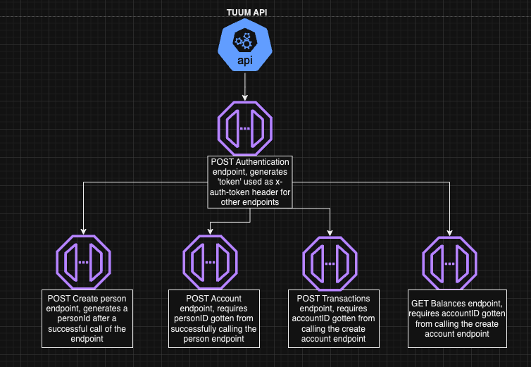

# API test automation using cypress for TUUM endpoints
In this project, cypress was used to write automated tests for some of tuum's endpoints. The following are the requirements necessary to have a successful setup of this project:

- [Cypress](https://docs.cypress.io/guides/getting-started/installing-cypress)
- [Docker with cypress image](https://github.com/cypress-io/cypress-docker-images)
- Node
- [Cypress mochawesome reporter](https://www.npmjs.com/package/cypress-mochawesome-reporter)

## Setup and run tests with node and npm
1. Clone this repository:
   ```bash
   git clone https://github.com/chikaogumka/cypress-api-testing
   ```
2. Navigate to the project directory:

   ```bash
   cd cypress-api-testing
   ```
3. Install all project dependencies:
   ```bash
   $npm install
   ```
4. Create a /cypress.env.json file and add all your environment variables that would be used to run the test at the root of the project. the variables I used includes:
    ```bash
    "x-request-id":"<X-REQUEST-ID>", //gotten from swagger example account-api endpoint
    "accountId":"<ACCOUNTID>", //generated after calling create account endpoint
    "personId":"<PERSONID>", //Generated after calling create person endpoint
    "token":"<TOKEN>" //Generated after calling auth endpoint
    ```
5. After all the project dependencies are installed, run cypress tests using the following command
    ```bash
   $npm run test 
   to run test with browser popup use:
   $npm run test:headed
   ```
6. After tests are done running 2 folders with reports of test results will be created in the root directory. One called /screenshots that contains all results files in images format and the /reports folder that contains reports in .html format that can be loaded in a browser. To load the results, open the index.html file located at this path cypress/reports/index.html

## Setup and run tests using Docker
1. After cloning this repository, [install docker](https://docs.docker.com/engine/install/) to your pc following the instructions provided in the link. Make sure the docker application for desktop is up and running.

2. The docker image used as a base was a version of the [cypress/include](https://hub.docker.com/r/cypress/included/tags) image as recommended on the official [cypress github page](https://github.com/cypress-io/cypress-docker-images)

3. Navigate to the root of the project where the docker file is located and build the docker image
```bash
   $cd cypress-api-testing
   //Open Docker application
   $open /Applications/Docker.app
   //Build docker image with this command
   $docker build -t my-cypress-image:1.0.0 .
   //Run the cypress test in the docker image using the following command which also prints test results to your project folder
   $docker run -i -v $PWD:/cypress-project -t my-cypress-image:1.0.0 (linux on a macbook)
   $docker run -i -v "%cd%":/cypress-project -t my-cypress-image:1.0.0 (on windows)
   ```
## Setup and run tests using Postman
1. Download the chika-ogumka-tuum-assignment.postman_collection.json file attached to the email
2. Import the collection into postman
3. Run the collection in this order:
 

# Test Plan and strategy for Tuum endpoints

The following endpoints were tested in this project:
- Create Account
- Get Balances
- Create Transactions
- Create User Authentication
- Create Account balance (Additional Endpoint)

## Testing Strategy
### Objectives and scope
- Ensured the correctness of the endpoints in scope
- Validate the data gotten after a request is made and the format of the response body
- Validate the performance and reliability of the endpoints (Not in scope of this test as no automated test was written for it)
- Validate the security of the endpoints (Not in scope of this tests as no automated tes was written to it)

### Automated test plan
1. Setup Environment by configuring cypress, fixtures and environment variable
2. Create Test cases
    - Test case for each endpoint
    - Include both positive and negative test case
3. Create test cases
4. Run tests and gather test results

### Test cases for endpoints
1. POST Authentication endpoint
    - Endpoint: https://auth-api.sandbox.tuumplatform.com/swagger-ui/index.html#/employee-api/authoriseEmployee
    - Test Cases:
        - it should authenticate an employee, return a 200 status with valid data
        - it should not allow authentication and return a 400/401 when an invalid authentication data is sent
        - Validate response structure and status code
2. POST Create account endpoint:
    - Endpoint: https://account-api.sandbox.tuumplatform.com/swagger-ui/index.html#/account-api/createAccountV4
    - Test Cases:
        - it should create an account successfully, set accountid as env variable and return 200 status
        - it should not create an account when a bad request is sent with invalid data
        - Validate response structure and status code
3. GET Balances endpoint
    - Endpoint: https://account-api.sandbox.tuumplatform.com/swagger-ui/index.html#/account-balance-api/findAccountBalance
    - Test Cases:
        - it should retrieve account balances successfully and return 200
        - it should not retrieve account balances when a bad request is sent
        - Validate response structure and status code
4. POST Create transactions endpoint
    - Endpoint: https://account-api.sandbox.tuumplatform.com/api/v5/accounts/ID-1000/transactionscreateTransactionV4
    - Test Cases:
        - it should create a transactions successfully and return 200 status
        - it should fail to create transactions when wrong credentials are sent
        - Validate response structure and status code
5. POST Create account balance (Bonus endpoint to enable me add account balance data to the system)
    - Enpoint: https://account-api.sandbox.tuumplatform.com/api/v1/accounts/:accountId/balances
    - Test Cases:
        - it should create account balance successfully and return 200 status
        - it should not create account balance when wrong data is sent
        - Validate response structure and status code

Below is a mind map of how this test was designed and how I imagined the endpoints worked. The last endpoint was not added to the diagram as it was not originally in scope of this test.



## Postman Collection and test results
- Test result url: https://web.postman.co/workspace/My-Workspace~0af3baaf-3350-418a-8e1d-ec424235bf67/run/32763935-7c35ac92-6af1-4b75-b66f-fac829aa6fb2

- 

## Drawbacks and issues experienced
- I could not get a 200 response on the create person response which was supposed to generate a personID and set it to a cypressEnv variable which I would then need for the create account endpoint
- This lead to a ripple effect of not being able to get any 200 response from the rest of the endpoints
- An accountid is also required to make a request to the get balances api endpoint. Using the accounted ID-2000, as seen in the sample request in swagger, still returned a 404 not found status
- The create transactions endpoint https://account-api.sandbox.tuumplatform.com/swagger-ui/index.html#/account-transaction-api/createTransactionV4
 AccountV4 has been deprecated so I used the endpoint referenced under the deprecated endpoint: https://account-api.sandbox.tuumplatform.com/swagger-ui/index.html#/account-transaction-api/createTransactionV5
